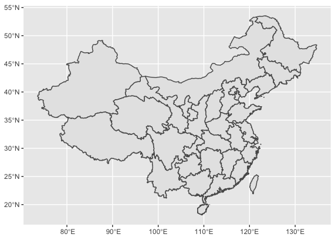
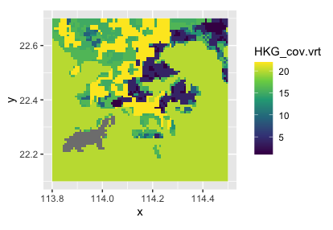
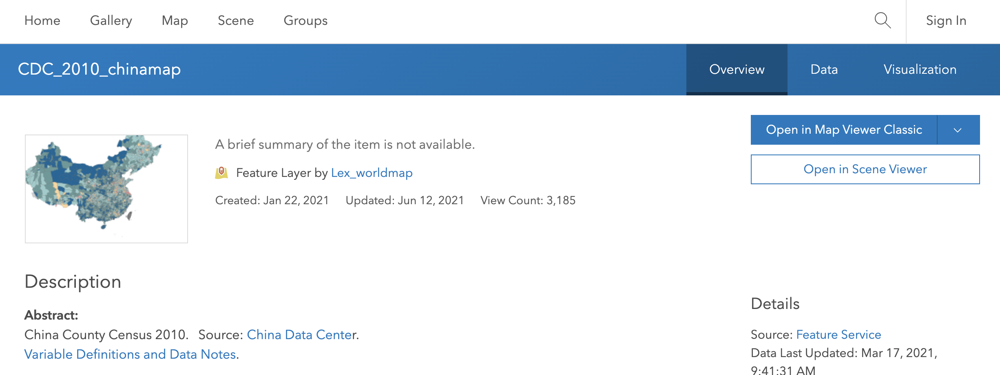
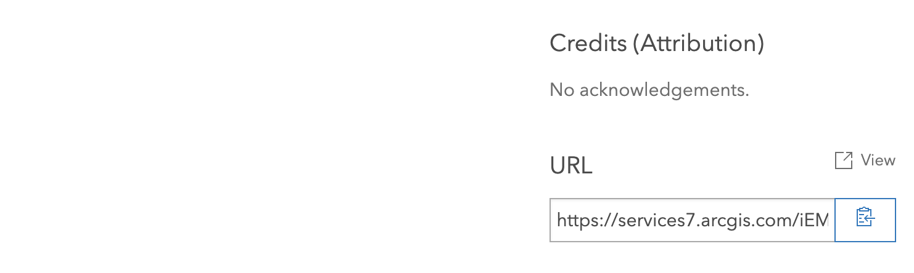

```{r setup, include=FALSE}
library(learnr)
library(sf)
library(ggplot2)
library(stars)
library(arcpullr)

knitr::opts_chunk$set(echo = TRUE)
tutorial_options(exercise.timelimit = 180)   # secs, I added this to allow for long download/rendering times for spatial data/maps
```

## Module 2. Spatial packages for R

**Author**

Edmund Seto  
Associate Professor  
Department of Environmental & Occupational Health Sciences  
University of Washington  
eseto@uw.edu

This is Module 2 within a [course on Spatial Analysis in R](https://www.edmundseto.com/edmundseto/introduction-to-spatial-analysis-for-r-a-focus-on-environmental-health/).

This module will describe common spatial data and how they are imported into R. The module will introduce some packages for helping to import and displaying spatial data.

## Install RStudio

As described in the module 1, this module will show R code that you can run on your own computer in R or RStudio. If you wish to develop your own analysis projects, you should install R or RStudio on your own computer. There's also an exercise later, where you can run R code chunks directly on this website. 

The tutorial in the previous module describes how to install RStudio: https://moderndive.netlify.app/1-getting-started.html

## Spatial data

Spatial data comes in two main types:

- vector data (points, lines, polygons)  
- raster data (pixels)

These data are distributed in various data file formats. For vector data, the *shapefile* is a commonly used file format.

For example, here's a website with some shapefiles for China:
https://data.humdata.org/dataset/cod-ab-chn

Notice that they're distributed as a compressed zip file. Download the "chn_adm_ocha_2020_SHP.zip" file at that site, and uncompress it.

After you uncompress it, you'll notice that you get a directory with various files that have filenames ending in .shp, .dbf, .prj, and so on.  Collectively, these multiple files make up the shapefile and contain different aspects of the spatial vector dataset.

Raster data are distributed in a different format. The *grid* format is a commonly used file format.

For example, here's a website with some grid data.  
https://www.diva-gis.org/gdata

At that site, select "Hong Kong" for Country, and select "Land cover" for Subject, and press "OK". You should see that it gives you a link to download data.  Here's the direct link to the data:  https://biogeo.ucdavis.edu/data/diva/cov/HKG_cov.zip

Notice that again it's a compressed zip file. Uncompress it.

After you uncompress it, you'll notice that you get a directory with various files that have filenames ending in .grd, .gri, and so on.  Collectively, these multiple files make up the grid and contain different aspects of the spatial raster dataset.

Here's what both of the previous downloaded vector and raster data look like.  We'll cover how to these were read into R next.






## Spatial Packages in R

R by itself doesn't have functions to easily import and work with spatial data.  However, the user community has created packages for this.

Let's use the *sf* (Simple Features) package to import and plot the shapefile that we downloaded before.  The sf package understands spatial data objects and can therefore store vector data like points, lines, and polygons.

If you're working on your own RStudio project, and need to install the sf package, you can install it by following the instructions on the sf github website: https://github.com/r-spatial/sf  
Note that the install process on Windows requires Rtools to be installed.  The install process on MacOS requires the installation of gdal.  I suggest following their installation instructions, then typing the regular command in the R console to install the package:  
`install.packages("sf")`

We'll also use the visualization package called ggplot2. Let's install it too:  
`install.packages("ggplot2")`

The packages used in this module, were already preloaded using these commands:

```{r module2_libs, eval = FALSE}
library(sf)
library(ggplot2)
library(stars)
library(arcpullr)
```

## Reading a shapefile

The code below can read the shapefile and plot it. Rendering figures can take a minute to finish running because it takes time to render the figure.

```{r module2_sf_shapefile_example}
# st_read is used to read the shapefile that we downloaded. 
# provide the path and filename to the shapefile
theshp <- st_read("data/chn_adm_ocha_2020_shp/chn_admbnda_adm1_ocha_2020.shp")

# this uses the ggplot2 library to plot the shapefile.
# in ggplot, the geom_sf function is used to plot a sf object
ggplot(theshp) + geom_sf()
```

## Result of reading shapefile

Notice after reading the the shapefile into the variable *theshp* it returns some information about the spatial object.

It said that it used a driver for ESRI Shapefile to read the shapefile.  
It said that that reading the file resulted in a simple feature spatial object.  
There were 34 *features* (in this example 34 provinces in China!)  
There were 6 *fields*.  Fields represent data or attributes for each of the features. For example one field might be the name of the province. Another field might be the area of the province.  
Next, it reports that the features have a geometry type of *MULTIPOLYGON*.  
Finally, there is some information on the *coordinates* of the geometry that were provided by the shapefile. In this case it reports a bounding box (lower left coordinate and upper right coordinate), as well as something called the coordinate reference system (CRS) of 4326. 

**What is a CRS?**

In order to locate spatial objects on the earth we need some sort of coordinate system.  

In 2-dimensional geometry, like we learned in grade school, we can represent locations on a plane using x and y coordinate measurements.  

However, identifying objects on the Earth is more challenging because it's not flat (Yes, the Earth is NOT flat!).  So there are various coordinate systems, such as latitude and longitude to measure locations on a sphere. Latitude and Longitude may be provided as units of degrees, minutes, seconds.  They can also be provided as decimal degrees.  Latitude can be positive (North) or negative (South) of the equator (0 latitude).  Longitude can be positive (East) or negative (West) of the prime meridian (0 longitude).

But what we want to pretend like the world is flat?  Sometimes it's useful to *project* or transform the spherical coordinates to a simple x and y 2-dimensional coordinate system. Think a flat paper map of the world -- this is an example of a projected coordinate transformation. A mathematical model was used to convert the latitude and longitude coordinates to a relatively simple x and y coordinate system so that world could be printed on a map.  There are various projected coordinate systems that are used in different parts of the world. For example the Universal Transverse Mercator (UTM) system uses different *zones* that are specific to different regions of the world to convert spheric coordinates to x and y coordinates in units of meters.

To learn more about about coordinate systems, see: https://en.wikipedia.org/wiki/Spatial_reference_system

The CRS of 4326 corresponds to a specific coordinate system. Let's look it up on this site: https://epsg.io/4326  
Note that this corresponds to the World Geodetic System 1984 (WGS84) -- a common coordinate system that is used in most Global Positioning System (GPS) receivers and in most online mapping systems.  The units are in decimal degrees for latitude and longitude coordinates.

## How did we plot the shapefile?

Notice we used the ggplot2 package to plot the shapefile.  That was one way to plot it.

But we could have just called:  
`plot(theshp)`  
and this would have shown us the geometry of the shapefile.  However, there are advantages to learning the ggplot2 package as it provides more options to alter the appearance of the plot, and allows us to combine various spatial objects into a single plot.  We'll explore some of these ggplot2 capabilities later.

Notice that the simpliest way to use ggplot2 is to first tell ggplot2 what data will be used. That's the ggplot(theshp) portion of the code.  And then we also tell it what type of geometric object to use to plot the data provided in theshp.  That's the + geom_sf() portion of the code.

Notice when we tell it to use geom_sf(), ggplot2 is smart enough to look at the coordinate system of the data, notice that it's latitude and longitude coordinates and label the axes of the figure with decimal degrees.  The units are "N" and "E" because China in this example is north and east of the equator and prime meridian, respectively.

## Reading a raster file

Let's now try to read the raster data file we downloaded before.

We will use the *stars* package to read the raster data.  If you need to install this package for your own analysis projects on your computer, type this into the console in RStudio:  
`install.packages("stars")`

The code below reads the raster data from the file and uses ggplot2 to plot the results.  You'll need to wait a minute for the code to render the plot.

```{r module2_stars_raster_example}
# read_stars is used to read the raster file that we downloaded. 
# provide the path and filename to the raster file
landcov_stars <- stars::read_stars("data/HKG_cov/HKG_cov.vrt")

# let's look at a summary of the data
landcov_stars

# this uses the ggplot2 library to plot the raster
# in ggplot, the geom_raster function is used to plot stars raster object
landcov_stars_df <- as.data.frame(landcov_stars, xy = TRUE)

ggplot(landcov_stars_df) + geom_raster(aes(x = x, y = y, fill = HKG_cov.vrt)) +
  scale_fill_viridis_c()
```

## Result of reading raster file

After reading the raster file into the variable *landcov_stars* using the stars::read_stars() function, we type landcov_stars on the next line of code. It returns some information about the spatial object.

It said that it read the data as a *stars* spatial object.  
There were two dimensions: an x and y coordinate.  
It also provides a statistical summary of the one attribute field stored in the raster. The field is called "HKG_cov.vrt".  For this example file, which contains landuse and landcover categories, the pixel values of the raster represent specific landuse / landcover categories.  
Where it lists the x and y coordinate information notice that it mentions "WGS 84" -- that's the same WGS84 that we saw before for the CRS for the shapefile we read and plotted previously.

## How did we plot the raster?

Like the shapefile example, we also used ggplot2 to plot the raster data. That was one way to plot it.

But we could have just called:  
`plot(landcov_stars)`  
and this would have shown us the raster.  

With the ggplot2 method, we first needed to convert the raster to a *data frame*, which is a tabular representation of the raster data.  We used the as.data.frame() function to do that conversion.  The xy=TRUE argument is needed for raster data, to store the spatial coordinates in the resulting data frame.

Next we call ggplot(landcov_stars_df), where we tell ggplot2 to use data in the landcov_stars_df variable. And then we also tell it what type of geometric object to use to plot the data provided. In this case, we use the + geom_raster() function to tell ggplot2 that we're plotting a raster.  

Notice that we had to give additional parameters to the geom_raster() function. We needed to tell it that the x coordinate is called "x" in the data, the y coordinate is called "y" in the data, and the use the values in the "HKG_cov.vrt" field to fill or color the pixels of the raster in the plot.

We added an option in the ggplot command:  
`scale_fill_viridis_c()`  
tells ggplot2 to use the viridis coloring scheme.  Learn more about coloring schemes like viridis here: https://cran.r-project.org/web/packages/viridis/vignettes/intro-to-viridis.html  


## Saving data

At some point in your work you may wish to save spatial objects that you have modified or created in R, perhaps to share with others. You can do this using standard R data saving functions. For example:  
`saveRDS(theshp, file="theshp_saved_file.rds")`

This saves the spatial object "theshp" toa file named "theshp_saved_file.rds" in your working directory.

To load the data back into a new R session, you would use the standard read function.  For example:  
`new_shp <- readRDS(file="theshp_saved_file.rds")`

Notice we read it into a new variable in R called "new_shp".

While this works for most R data objects and some spatial objects like those made with the *sf* package, it may not work for all spatial objects.  For example, I have found that it doesn't work well for *stars* raster objects.  

Stars objects are odd in that they sometimes consist of external pointers to other files on your computer like a tif raster file.  So if you use saveRDS() to save the stars object and share it with a friend, when your friend tries to use readRDS() to load the raster, R may complain that it can't find the file -- which file? -- the original tif raster file!

For these reasons, it's usually better to use "native" saving functions from the various packages to make sure the entire data are being saved and not just external pointers to other files.

So if we want to export an sf vector object to a shapefile. The sf package has a function st_write() that does this:  
`st_write(theshp, "theshp_saved_shapefile.shp")`

Similarly, to save a raster to a common raster format, the stars package has a write_stars() function.  However, write_stars() may not understand how to export to all file formats, including GRID format.  Most examples, export to TIFF, which is another common raster file format:  
`write_stars(landcov_stars, "raster_saved_tiff_file.tif")`


## Success!

We just reproduced the steps needed to load and plot both kinds of spatial data.

But there are other ways of loading spatial data into R.


## Reading spatial data from online servers

Data may also be provided online, not as files for you to download, but rather as data services that you can query and use in your projects.

An example of this is the ArcGIS Online service. Harvard's WorldMap is implmented on ArcGIS Online, and it provides a platform where scholars can share geospatial information.  
https://worldmap.maps.arcgis.com

If you use the search function on that site, and search for "ChinaMap", it will bring you to various spatial data layers shared by Harvard researchers:  Here's a direct link to ChinaMap:  
https://worldmap.maps.arcgis.com/home/item.html?id=2b3e59efaa7f495e8e743ebfbeba95ca

On that website, scroll to and select "Population density (2010) km2".  This is spatial data that shows the population density across all of China.  
The link is: https://worldmap.maps.arcgis.com/home/item.html?id=85e049490ddf4ba68262e007a0ceed9c

{width=75%}  

You can explore the "Data" and the "Visualization" tabs on the page to see what the data look like.

If select the "Overview" tab, at the bottom right of that page you'll see a "URL":
 
{width=75%}  

That URL address can be used in R code to query the data.

To read from the ArcGIS Online site, we will use a package called *arcpullr*.  As before install the package if you haven't already installed it, and want to use it in your project:  
`install.packages("arcpullr")`

The code below queries and downloads spatial data from the server and use ggplot2 to plot the results.  You'll need to wait a minute for the code to query and download the data and to render the plot.

```{r module2_arcgisonline_feature_example}
# this variable stores the URL that we copied from the ChinaMap feature website:
chinamap_server_url <-"https://services7.arcgis.com/iEMmryaM5E3wkdnU/arcgis/rest/services/cdc_pop_90_2015/FeatureServer/0"

# get_spatial_layer function retrieves the data from the server.
# note we use an optional "where" clause to download specifically data for the Province of Beijing
chinamap_pop_beijing <- get_spatial_layer(chinamap_server_url, where = "Province = 'Beijing'")

# let's look at a summary of the data we downloaded
chinamap_pop_beijing

# and we use ggplot to plot the data.
ggplot(chinamap_pop_beijing) + geom_sf()
```

## Results of the online data query 

The data that returned are first shown as a table. It shows the fields that are available for the spatial features.  Notice how all the Province values are "Beijing" -- exactly as we requested in the "where" clause of the query.

Finally, the plot does not show all of China, but just Beijing districts that we queried and downloaded.

## Exercise

Try editing the same code as before, but download data for the Province of Shanghai.

Edit the code yourself, and the run it to see if you you're able to download and plot Shanghai Province spatial data.

```{r module2_arcgisonline_feature_exercise, exercise=TRUE, exercise.lines = 14}
# this variable stores the URL that we copied from the ChinaMap feature website:
chinamap_server_url <-"https://services7.arcgis.com/iEMmryaM5E3wkdnU/arcgis/rest/services/cdc_pop_90_2015/FeatureServer/0"

# get_spatial_layer function retrieves the data from the server.
# note we use an optional "where" clause to download specifically data for the Province of Beijing
chinamap_pop <- get_spatial_layer(chinamap_server_url, where = "Province = 'Beijing'")

# let's look at a summary of the data we downloaded
chinamap_pop

# and we use ggplot to plot the data.
ggplot(chinamap_pop) + geom_sf()
```

```{r module2_arcgisonline_feature_exercise-hint}
# try looking at where it says Beijing in the code and changing it to Shanghai

```


## Solution

Did you get the code to work correctly?

If you changed the code to:  
`chinamap_pop <- get_spatial_layer(chinamap_server_url, where = "Province = 'Shanghai'")`

Then you should have seen it correctly query and download and plot Shanghai districts.

## Quiz

Let's check what you've learned in this module.

```{r module2_quiz1, echo = FALSE}
quiz(
  question("The two main types of spatial data are:",
    answer("points and lines"),
    answer("polygons and rasters"),
    answer("vector and raster", correct = TRUE, message=random_praise()),
    answer("complex and simple"), 
    incorrect = "Sorry, incorrect",
    allow_retry = TRUE
  ),
  question("Which of the R packages is used to read shapefiles?",
    answer("sf", correct = TRUE, message=random_praise()),
    answer("grid"),
    answer("raster"),
    answer("ggplot2"),
    incorrect = "Please review the material again before retrying",
    allow_retry = TRUE
  ),
  question("CRS stands for:",
    answer("Cool Researchers Study"),
    answer("Computed R Script"),
    answer("Cats Relax Slowly"),
    answer("Coordinate Reference System ", correct = TRUE, message=random_praise()),
    incorrect = "Nope, incorrect",
    allow_retry = TRUE
  )
)
```

## Course website

Return to the main page for the [course on Spatial Analysis in R](https://www.edmundseto.com/edmundseto/introduction-to-spatial-analysis-for-r-a-focus-on-environmental-health/).
